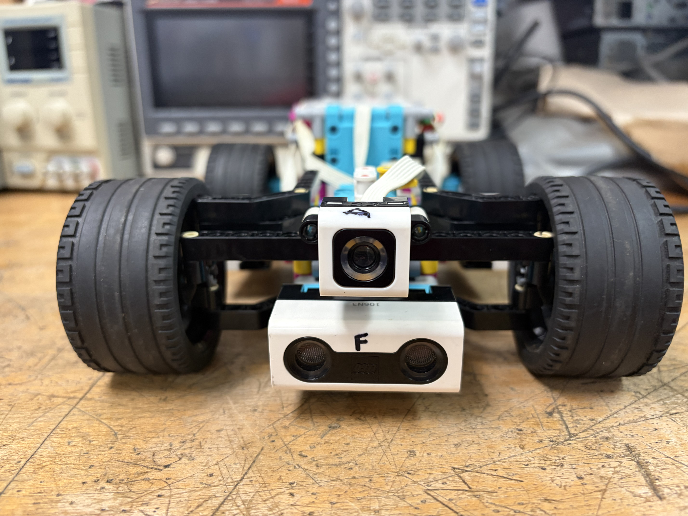
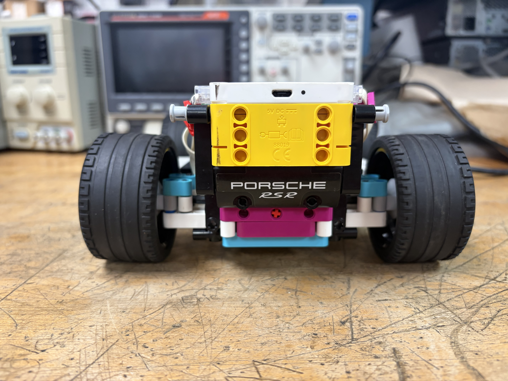

# WRO-Future-Engineers-2026
Autonomous self-driving car for WRO Future Engineers 2026
--
## Table of Contents

### Team & Documentation

| Section | Links |
|---|---|
| Team Introduction | [Team Introduction](#team-introduction) |
| Group Information | [Group name](#group-name) |

### Mechanical Design

| Section | Links |
|---|---|
| Mechanical Design & Steering | [Mechanical Design & Steering](#mechanical-design-and-steering) |
| Drivetrain & Weight Distribution | [Drivetrain & Weight Distribution](#drivetrain-and-weight-distribution) |
| Robot Problems & Solutions | [Robot Problems & Solutions](#robot-problems-and-solutions) |

### Sensors & Electronics

| Section | Links |
|---|---|
| Sensor Placement Strategy | [Sensor Placement Strategy](#sensor-placement-strategy) |
| Wiring & Port Management | [Wiring & Port Management](#wiring-and-port-management) |
| LEGO SPIKE Prime Technical Information | [Technical Information](#lego-education-spike-prime--technical-information) |
| Large Angular Motor | [Large Angular Motor](#large-angular-motor) |

### Software & Performance

| Section | Links |
|---|---|
| Software Architecture | [Software Architecture](#software-architecture) |
| Control Logic | [Control Logic](#control-logic) |
| Engineering Decisions & Trade-offs | [Engineering Decisions & Trade-offs](#engineering-decisions-and-trade-offs) |
| Performance & Future Work | [Performance & Future Work](#performance-metrics-and-future-work) |

### Photos & Development

| Section | Links |
|---|---|
| T-Photos | [T-Photos](./T-photos/) |
| V-Photos | [V-Photos](./V-photos/) |
| Mechanical Design File | [Mobility](./mobility.md%20(Diseño%20mecánico)) |

--
## Group name♥︎
team name:krabby-no-patty
teammates:
- Caleb Jair Rosa Roman
- Angelica Victoria Colon
- 

- country / región:Puerto Rico

---

---
## Team Introduction★

We are a team of three students from Puerto Rico—two 16-year-olds and one 15-year-old—competing in the WRO Future Engineers category. This repository documents our journey of building and programming an autonomous vehicle using the LEGO SPIKE Prime system.

---

## Mechanical Design and Steering♡ (prototype #1)

Our initial prototype had a major flaw: the steering range was too narrow. The front wheels would hit the Technic beams before reaching the angle needed for sharp turns. To fix this, we redesigned the front assembly to be more open. By trimming the frame and adjusting the gear linkage, we gained the "turn-headroom" necessary to avoid wall collisions. 
a
- Drivetrain and Weight Distribution:

The robot uses a Rear-Wheel Drive (RWD) configuration. We placed the LEGO SPIKE Hub and the drive motor in the back to ensure the weight is centered over the traction tires.
- Dimensions: Width: 18.5 cm | Length: 27.5 cm | Height: 9.5 cm.
- Current Challenge: We have observed an occasional slowdown in the drivetrain. We are currently investigating if this is caused by mechanical friction in the rear axle or a power-drop in the hub.
- Torque/Speed Reasoning:
  We chose a gear ratio that favors torque. We realized that maintaining a consistent speed through corners is more valuable than high top speeds that lead to "drifting" into the walls.

<table>
  <tr>
    <td>
      
    <td>
      
    <td>
            
  </tr>
   <tr>
    <td>
      
    <td>
      
    <td>
            
  </tr> 
</table>
---

## Sensor Placement Strategy◎

- Configuration: We use three sensors labeled C (Front), A (Left), and E (Right).
- Placement Rationale: Side sensors are placed at the widest point of the chassis to get the most accurate "distance-to-wall" readings. The front sensor is mounted low to ensure it detects obstacles before the bumper makes contact.
- Failure-Point Mitigation: We identified that ultrasonic sensors can sometimes provide "ghost readings". Our code is being tuned to cross-reference the A and E sensors; if one gives an impossible value, the robot relies on the other to maintain its lane.
- Wiring and Port Management
- Organization: All ribbon cables are routed through the internal Technic frame.
- Risk Identification: We learned that loose cables can snag on the steering rack. We used secure clips to ensure that the mechanical movement of the steering does not interfere with the electronic signals.

---

## Software Architecture□

Our robot is programmed using LEGO SPIKE Word Blocks. We chose this environment to allow for fast debugging and visual logic tracking during our limited testing sessions.

---
## Performance Metrics and Future Work

We don't just guess; we measure.
- Metric 1: After our steering rebuild, our turning radius decreased by roughly 35%, allowing us to stay 10cm further away from the outer wall during turns.

- Future Work: Our biggest goal is solving the "slowdown" mystery and perfecting our reverse-parking logic for the final challenge.

## Robot problems and solutions

we changed the pricipal idea, which was built for soft turns. That was a problem for our robot we needed it to make more sharp turns and go faster. But one of the moters was dameged, we decided to check puting a diferent moter on the front part of the car. now it centers and turns perfectly, we decided to change it because it would damage our proformence on future competitions.

- second problem:

The differential was changed for a better closed one, the first ones teeth were stripped and didnt work like it used to. we changed it to a closed one with better grip and better working mechanism. It was pretty easy to fix.

- third problem:

Because of the program the robot cant turn enough, we are still looking for a solution but if we find one we will keep this updated!. 

- fourth problem:

if it detected the center of the line it would tend to crash to the wall.

- solution:

see how long it takes to go from line to line

adjust tye robot/program so it goes more centered

- fith problem:

when we try to get to the robot to reach the center, it stops just short of it

- solution:

first, make the motor spin on its own for calibration and move to the center position

- center

99

- sixth problem:

the idea we had for adjusting the center of the curve ran into a complication because it kept slipping- it lacked the necessary support

----
## LEGO Education SPIKE Prime – Technical Information
Component

Technical Information

- Hub

Technic Large Hub 45601

- Ports

6 input/output ports: A, B, C, D, E, and F

- Display

5 × 5 white LED matrix

- Gyroscope

6-axis: 3-axis accelerometer + 3-axis gyroscope

- Connectivity

Bluetooth Low Energy + USB

- Programming

Scratch-based blocks and Python/MicroPython

- Speaker

Built-in, up to 12-bit / 16 kHz mono

- Battery

Rechargeable battery

- Number of pieces

528 pieces

- Recommended age

10+

- Motors

Large and Medium Angular Motors

- Sensors

Color, distance, and force sensors

-----

## Large Angular Motor

Operating voltage: 5–9 V

- No-load speed: 175 RPM ±15%

- Speed at maximum efficiency: 135 RPM ±15%

- Maximum stall torque: 25 N·cm

- Built-in position sensor

- Resolution: 360 counts per revolution

- Sensor update rate: 100 Hz

- Cable length: 250 mm
